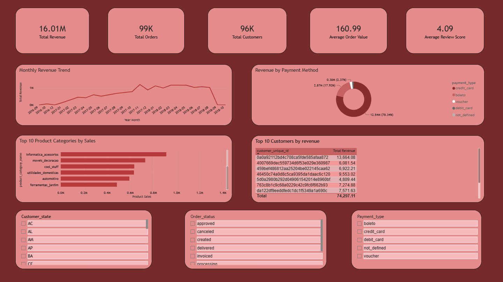
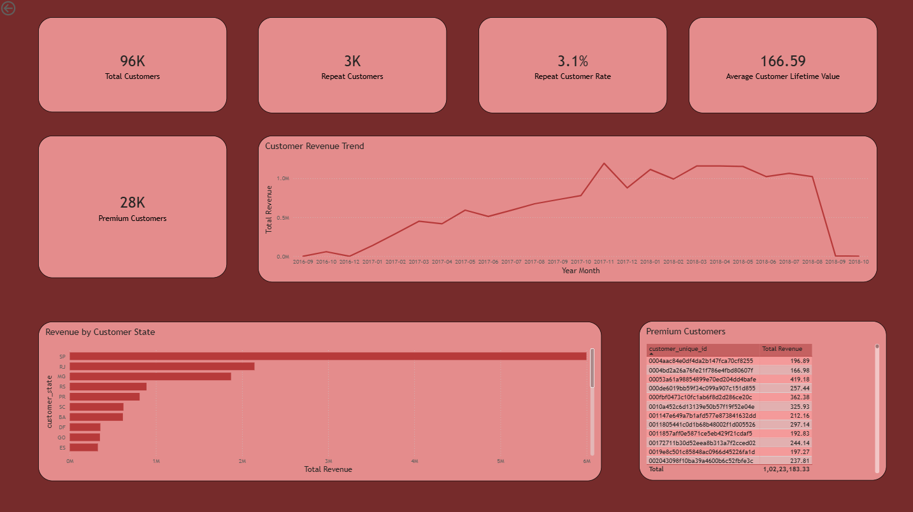
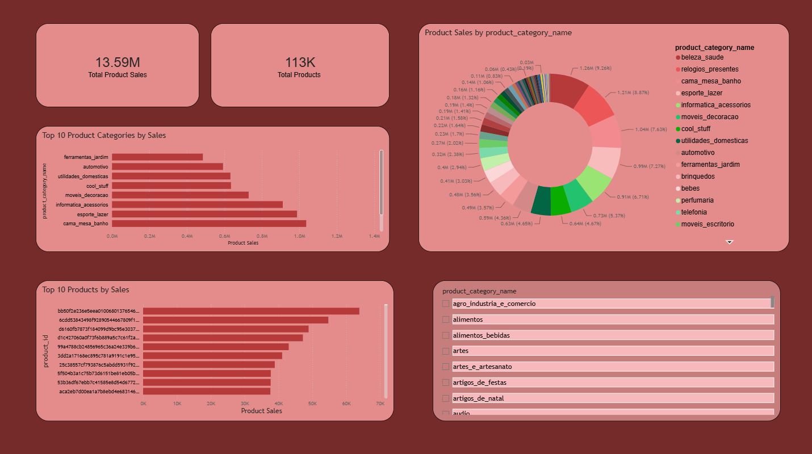
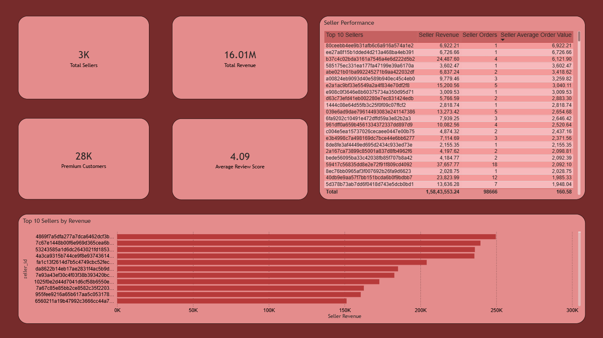

# 🛒 E-Commerce Sales & Customer Analytics

## 📌 Project Overview

An end-to-end data analytics project using the Brazilian E-Commerce Public Dataset by Olist.

The project analyzes **sales performance, customer behavior, products, categories, sellers, payments, reviews, and order trends** using **Python, MySQL, SQL, and Power BI**.

The workflow covers data loading, validation, cleaning, exploratory analysis, advanced SQL, data modeling, dashboard visualization, and business insights.

---

## 🎯 Business Objectives

- Analyze overall sales and revenue performance
- Identify top-performing products and categories
- Understand customer purchasing behavior
- Identify high-value and repeat customers
- Analyze monthly sales trends
- Evaluate seller performance
- Analyze payment and order patterns
- Generate actionable business insights

---

## 🗂️ Dataset

This project uses the **Brazilian E-Commerce Public Dataset by Olist**.

The dataset contains information about:

- Customers
- Orders
- Order Items
- Products
- Sellers
- Payments
- Reviews
- Geolocation
- Product Category Translation

### Dataset Files

```text
Dataset/
├── olist_customers_dataset.csv
├── olist_orders_dataset.csv
├── olist_order_items_dataset.csv
├── olist_products_dataset.csv
├── olist_sellers_dataset.csv
├── olist_order_payments_dataset.csv
├── olist_order_reviews_dataset.csv
├── olist_geolocation_dataset.csv
└── product_category_name_translation.csv
```

---

## 🛠️ Tools & Technologies

| Tool | Purpose |
|---|---|
| **MySQL** | Database management, validation, cleaning and analysis |
| **SQL** | Business analysis and advanced querying |
| **Python** | Data loading and database integration |
| **Pandas** | Data handling and processing |
| **SQLAlchemy** | Python–MySQL database connection |
| **Power BI** | Interactive dashboards and visualization |
| **GitHub** | Version control and project documentation |

---

# 🐍 Python

Python is used to load the CSV datasets into MySQL and support the database integration workflow.

### Technologies

- Python
- Pandas
- SQLAlchemy
- MySQL

### Notebook

```text
Python/
└── import_data.ipynb
```

The notebook contains the data import workflow and verification of imported tables.

---

# 🗄️ SQL Analysis

The SQL analysis is organized into 10 stages:

```text
SQL/
├── 01_Data_Validation.sql
├── 02_Data_Cleaning.sql
├── 03_Exploratory_Data_Analysis.sql
├── 04_Basic_SQL.sql
├── 05_Joins.sql
├── 06_Subqueries.sql
├── 07_Window_Functions.sql
├── 08_CTEs.sql
├── 09_Views.sql
└── 10_Business_Case_Studies.sql
```

### SQL Skills Demonstrated

- Data Validation
- Data Cleaning
- Exploratory Data Analysis
- `SELECT`, `WHERE`, `ORDER BY`
- `GROUP BY` and `HAVING`
- `JOIN`
- Subqueries
- CTEs
- Window Functions
- `RANK()`
- `DENSE_RANK()`
- `ROW_NUMBER()`
- `LAG()`
- Date Functions
- Views
- Business Case Studies

---

# 📊 Power BI Dashboard

Power BI was used to build interactive dashboards for:

- Sales performance
- Revenue trends
- Customer analysis
- Product and category performance
- Seller performance
- Order trends
- Payment analysis

> The `.pbix` Power BI file is not included in this repository because of its large file size. Dashboard screenshots are available in the `Images/` folder.

## Dashboard Preview

### Executive Dashboard



### Customer Analysis



### Product Analysis



### Seller Performance



---

# 💡 Key Business Insights

Based on the values and visuals displayed in the Power BI report:

1. The dashboard reports approximately **16.01M total revenue** from approximately **99K orders** and **96K customers**.
2. The overall **Average Order Value is 160.99**.
3. The overall **Average Review Score is 4.09**.
4. There are approximately **3K repeat customers**, representing a **3.1% repeat customer rate**.
5. Approximately **28K customers** are classified as premium customers in the dashboard.
6. **São Paulo (SP)** is the highest-revenue customer state among the states displayed.
7. **Credit card** is the dominant payment method by revenue, contributing approximately **78.34%** of displayed payment revenue.
8. Product analysis reports approximately **13.59M total product sales** across approximately **113K products**.
9. `beleza_saude`, `relogios_presentes`, and `cama_mesa_banho` are among the leading displayed product categories.
10. Seller analysis provides seller-level revenue, order count, and average order value for performance comparison.

> These insights are based on the values and visuals displayed in the Power BI report.

---

# 🔄 Project Workflow

```text
Raw CSV Dataset
       ↓
Python / Pandas
       ↓
MySQL Database
       ↓
Data Validation
       ↓
Data Cleaning
       ↓
Exploratory Data Analysis
       ↓
Basic & Advanced SQL
       ↓
Joins / Subqueries / Window Functions / CTEs
       ↓
MySQL Views
       ↓
Power BI Data Model & DAX
       ↓
Interactive Dashboards
       ↓
Business Insights
```

---

# 📁 Repository Structure

```text
E-Commerce-Sales-Customer-Analytics/
│
├── Dataset/
│   ├── olist_customers_dataset.csv
│   ├── olist_orders_dataset.csv
│   ├── olist_order_items_dataset.csv
│   ├── olist_products_dataset.csv
│   ├── olist_sellers_dataset.csv
│   ├── olist_order_payments_dataset.csv
│   ├── olist_order_reviews_dataset.csv
│   ├── olist_geolocation_dataset.csv
│   └── product_category_name_translation.csv
│
├── Images/
│   ├── executive_dashboard.png
│   ├── customer_analysis.png
│   ├── product_analysis.png
│   └── seller_performance.png
│
├── Python/
│   └── import_data.ipynb
│
├── SQL/
│   ├── 01_Data_Validation.sql
│   ├── 02_Data_Cleaning.sql
│   ├── 03_Exploratory_Data_Analysis.sql
│   ├── 04_Basic_SQL.sql
│   ├── 05_Joins.sql
│   ├── 06_Subqueries.sql
│   ├── 07_Window_Functions.sql
│   ├── 08_CTEs.sql
│   ├── 09_Views.sql
│   └── 10_Business_Case_Studies.sql
│
└── README.md
```

---

# 📚 Skills Demonstrated

### SQL
**MySQL • Joins • Subqueries • CTEs • Window Functions • Views • Data Cleaning • EDA • Business Analysis**

### Python
**Python • Pandas • SQLAlchemy • Data Loading • Database Integration**

### Power BI
**Data Modeling • DAX • KPI Cards • Slicers • Top-N Analysis • Interactive Dashboards • Date Table • Relationships**

### Analytics
**Sales Analytics • Customer Analytics • Product Analytics • Seller Analytics • Revenue Analysis • Customer Behavior • Business Intelligence**

---

# 👨‍💻 Author

## Ashish Gautam

**Aspiring Data Analyst**

**SQL | Python | Power BI | Excel**

---

⭐ If you found this project useful, feel free to explore the dataset, SQL analysis, Python notebook, and dashboard screenshots.
